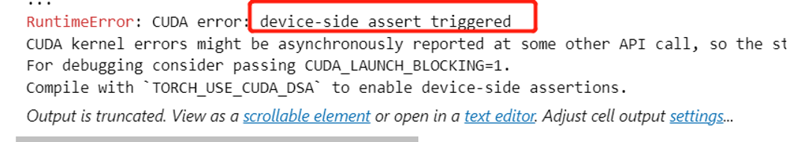
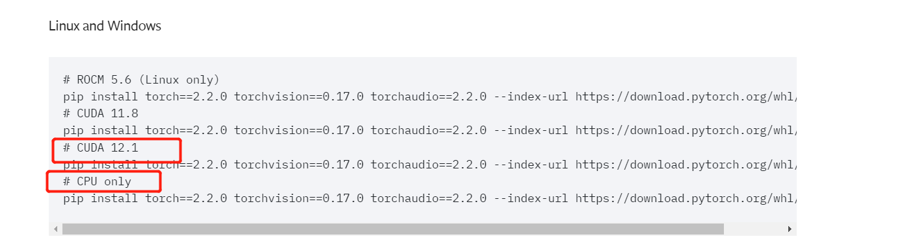
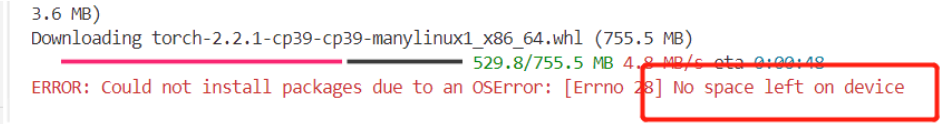
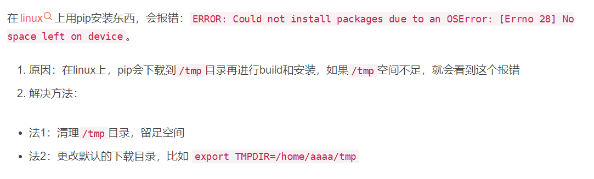

# 踩坑宝典

那些年学习**Transforms & HuggingFace**踩过的坑，

你可能在这里找到一些bug的解决方法，

找不到就上百度 or Google，

再找不到，盲生，你的SCI在路上了。


## 1 安装Minicoda、设置虚拟环境

```python
# 让conda命令生效，配置环境变量
vim ~/.bashrc

# 写入
export PATH=/你的安装路径/miniconda3/bin:$PATH
    
# 生效
source ~/.bashrc
```

```python
# 命令行：设置虚拟环境
conda create -n LLMpython39 python=3.9

conda env list

conda activate LLMpython39

```

## 2 设置huggingface缓存路径

```python
# 在bashrc文件中写入：
export HF_HOME=/您想要缓存的路径/huggingface
export TRANSFORMERS_CACHE=/您想要缓存的路径/huggingface

```

## 3 服务器不能下载huggingface模型？

```python
# 配置镜像代理，在bashrc文件中写入：
export HF_ENDPOINT=https://hf-mirror.com
```

## 4 cuda报错

报错如下：



原因：

torch和cuda版本不匹配。

1. 查看cuda版本（自行百度）

2. 根据cuda版本找torch版本：<https://pytorch.org/get-started/previous-versions/>

   

## 5 查看显卡使用情况

```
>> pip install gpustat
>> gpustat -i
```

## 6 pip安装torch显示磁盘空间不够

报错：



解决：

清除/tmp缓存：



